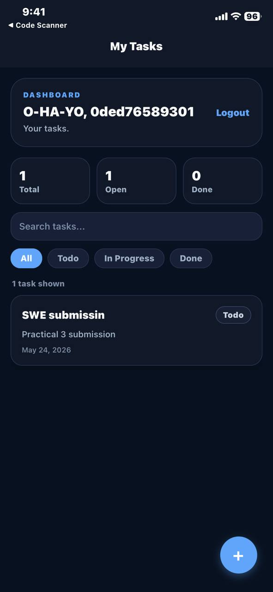
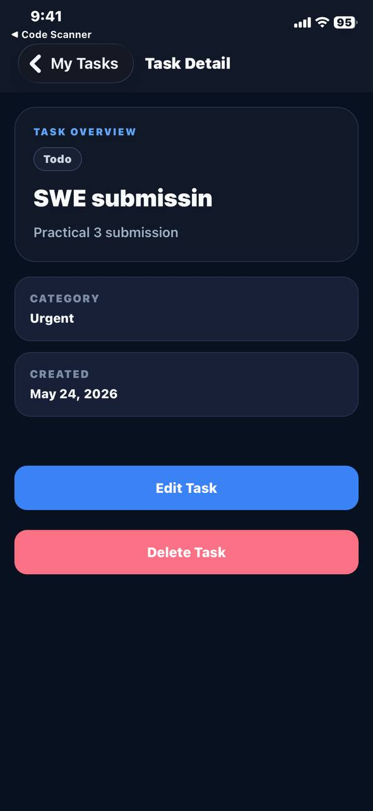

# Task Manager App

## Simple Project Report

Task Manager App is a mobile app built with Expo and React Native. It helps users sign in, view their tasks, and manage daily work in one place.

### What the app does

- Lets users log in or sign up
- Shows a task dashboard with quick task stats
- Allows users to search and filter tasks
- Supports creating, editing, and viewing task details
- Lets users assign a status and category to each task

### Main screens

- Login and sign up

- Task list dashboard

- Task details page

- Task create and edit form

### Tech used

- Expo / React Native
- TypeScript
- Expo Router
- Zustand for state management
- Axios for API calls

### How to run

1. Open the `TaskManagerApp` folder.
2. Install dependencies with `npm install`.
3. Start the app with `npm start`.
4. Use the Expo Go app, Android emulator, or iOS simulator to view it.

### Short summary

This project is a simple and clean task management app designed to help users organize tasks quickly and easily.
